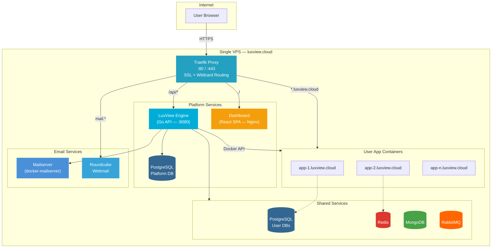
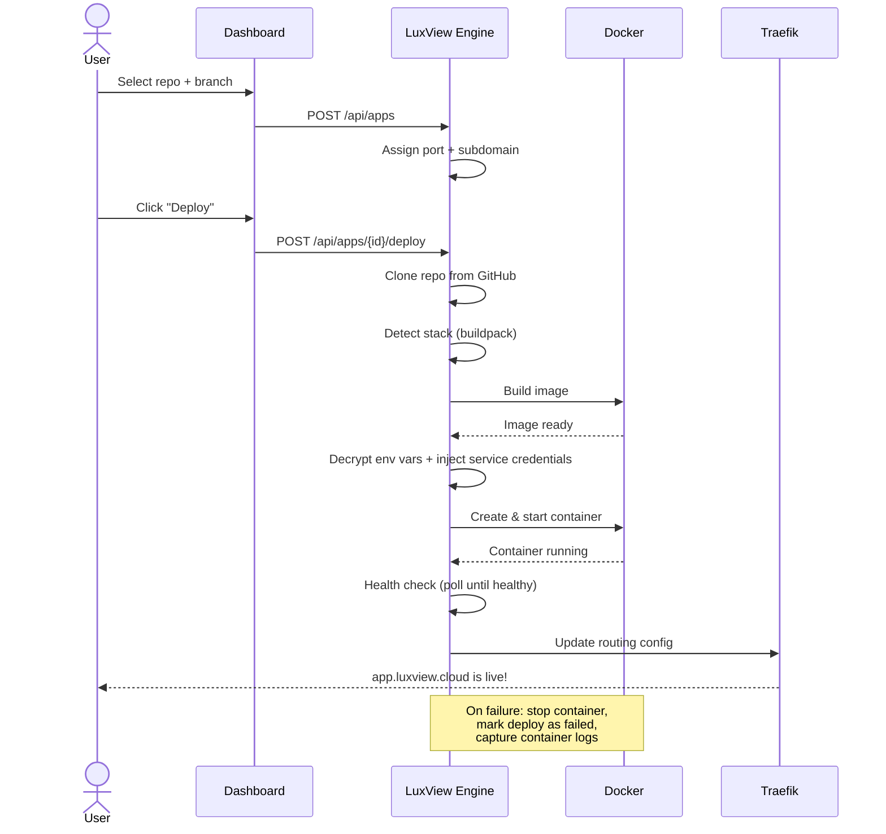
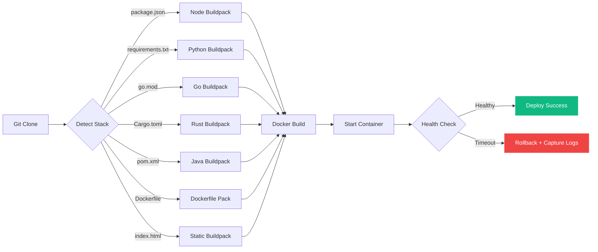
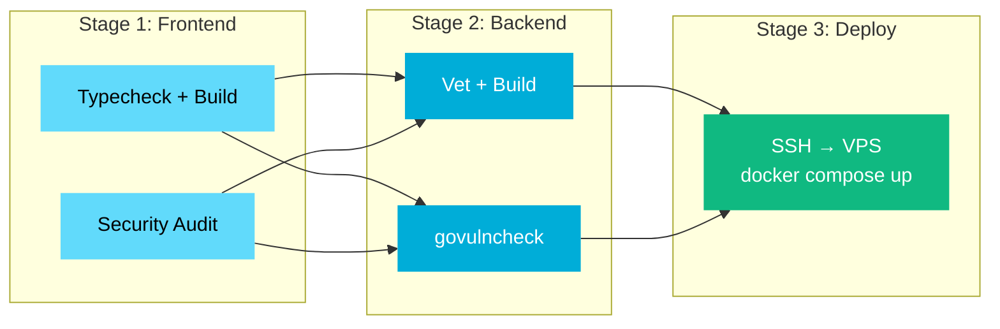
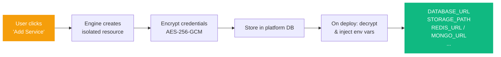

<div align="center">


# LuxView Cloud

**Your own Platform as a Service — deploy from GitHub in one click.**

[](https://go.dev)
[](https://react.dev)
[](https://docker.com)
[](https://traefik.io)
[](https://typescriptlang.org)
[](https://github.com/JohnPitter/luxview-cloud/actions)
[](#)

[Features](#-features) · [Architecture](#-architecture) · [Deploy Flow](#-deploy-flow) · [CI/CD](#-cicd-pipeline) · [Getting Started](#-getting-started) · [Tech Stack](#-tech-stack)

</div>

---

## What is LuxView Cloud?

LuxView Cloud is a **self-hosted PaaS** that turns a single VPS into a full deployment platform. Connect your GitHub account, pick a repository, and deploy with one click. The platform **auto-detects your stack** (Node.js, Python, Go, Rust, Java, static sites, or any Dockerfile), builds a Docker image, starts an isolated container, provisions a subdomain with automatic SSL, and keeps everything running.

Think of it as your own **Heroku / Railway / Render** — but you own the infrastructure.

---

## Features

| Category | What you get |
|---|---|
| **One-Click Deploy** | Select a GitHub repo, pick a branch, deploy. That's it. |
| **Auto Stack Detection** | Node.js, Python, Go, Rust, Java, static, Docker — all auto-detected |
| **Wildcard SSL** | Every app gets `<app>.luxview.cloud` with automatic HTTPS via Let's Encrypt |
| **Managed Services** | Provision PostgreSQL, Redis, MongoDB, or RabbitMQ per app |
| **DB Explorer** | Browse tables, view schemas, and execute SQL queries directly in the dashboard |
| **Storage Explorer** | Upload, download, and manage files in your app's local storage volumes |
| **Email Hosting** | Managed email service with mailbox provisioning and Roundcube webmail |
| **Environment Variables** | Encrypted at rest (AES-256-GCM), injected at deploy time |
| **Real-time Metrics** | CPU, RAM, and network usage per container — live in the dashboard |
| **Real-time Logs** | SSE-streamed runtime logs (newest first, paginated) + full build logs |
| **Auto Deploy** | Push to your branch, GitHub webhook triggers a new deploy automatically |
| **Rollback** | One-click rollback to any previous successful deployment |
| **Alerts & Notifications** | Configure CPU/memory thresholds and get notified via persistent notifications |
| **Resource Limits** | CPU and memory limits per app (cgroups-enforced) |
| **Internationalization** | Full i18n — English, Português (BR), Español. Auto-detects browser language |
| **Guided Tours** | Interactive tutorials on every page via react-joyride. First-time onboarding included |
| **GitHub OAuth** | Secure login via GitHub — no passwords to manage |
| **Maintenance Mode** | Toggle auth on/off for platform maintenance |

---

## Architecture



### How the pieces fit together

| Component | Role | Tech |
|---|---|---|
| **Traefik** | Reverse proxy, SSL termination, wildcard routing | Traefik v3 |
| **LuxView Engine** | REST API — builds, deploys, manages containers, provisions services | Go 1.26 + Chi |
| **Dashboard** | Web UI — deploy wizard, app management, metrics, logs, DB explorer, file browser | React 19 + Vite + Tailwind |
| **Docker Engine** | Runs isolated user app containers | Docker API |
| **PostgreSQL (platform)** | Stores users, apps, deployments, services, metrics, alerts | PostgreSQL 16 |
| **PostgreSQL (shared)** | User app databases — one isolated DB + user per app | PostgreSQL 16 |
| **Redis / MongoDB / RabbitMQ** | Optional services provisioned per app | Managed containers |
| **Local Storage** | File storage volumes per app | Docker volumes |
| **Mailserver** | Email hosting with SMTP/IMAP | docker-mailserver |
| **Roundcube** | Webmail client | Roundcube |

---

## Deploy Flow



### Build Pipeline Detail



---

## CI/CD Pipeline

Every push to `main` runs through an automated pipeline with **3 sequential stages**:



| Stage | Jobs | What it validates |
|---|---|---|
| **Frontend** | `tsc -b`, `vite build`, `npm audit` | Type safety, build integrity, dependency security |
| **Backend** | `go vet`, `go build`, `govulncheck` | Code correctness, compilation, vulnerability scan |
| **Deploy** | SSH into VPS, `git pull`, `docker compose up --build` | Automated deployment (only on `push`, skipped for PRs) |

Pull requests run Stages 1 and 2 only (no deploy).

---

## Service Provisioning

When you add a service to your app, LuxView automatically:

1. **Creates** an isolated resource (database + user, storage directory, etc.)
2. **Generates** a secure 24-char random password
3. **Encrypts** credentials at rest (AES-256-GCM)
4. **Injects** connection env vars into your container on every deploy
5. **Isolates** access — each app user can only see their own data



**Supported services and injected env vars:**

| Service | Env Vars Injected |
|---|---|
| PostgreSQL | `DATABASE_URL`, `PGHOST`, `PGPORT`, `PGUSER`, `PGPASSWORD`, `PGDATABASE`, `SPRING_DATASOURCE_URL`, `SPRING_DATASOURCE_USERNAME`, `SPRING_DATASOURCE_PASSWORD` |
| Redis | `REDIS_URL`, `REDIS_HOST`, `REDIS_PORT`, `REDIS_PASSWORD` |
| MongoDB | `MONGODB_URL`, `MONGO_URL` |
| RabbitMQ | `RABBITMQ_URL`, `AMQP_URL` |
| Storage | `STORAGE_PATH` |

### DB Explorer & Storage Explorer

The dashboard includes built-in tools to interact with your provisioned services:

- **DB Explorer** — Browse tables, view column schemas (type, nullable, default), and execute arbitrary SQL queries with a built-in editor (Ctrl+Enter to run). Results are displayed in a paginated grid with copy-to-clipboard support. Limited to 1,000 rows per query for safety.
- **Storage Explorer** — Navigate folder structures, upload files (multi-file, up to 50MB), download, and delete files. Includes breadcrumb navigation, search filtering, and file size/date metadata.

### Service Isolation

Every provisioned service enforces strict per-app isolation:

| Service | Isolation Strategy |
|---|---|
| PostgreSQL | Dedicated database + user with `OWNER`, `REVOKE ALL ON SCHEMA public FROM PUBLIC` |
| Redis | Unique DB number (0–15) per app |
| MongoDB | Dedicated user with `readWrite` role scoped to app database |
| RabbitMQ | Dedicated vhost + user with vhost-scoped permissions |
| Storage | Isolated directory per app |

---

## Getting Started

### Prerequisites

- Docker & Docker Compose
- A domain with wildcard DNS (`*.yourdomain.com`)
- GitHub OAuth App credentials

### Development

```bash
# Clone
git clone https://github.com/JohnPitter/luxview-cloud.git
cd luxview-cloud

# Configure
cp .env.example .env
# Edit .env with your GitHub OAuth credentials

# Start all services
make dev

# Run migrations
make migrate-dev

# Access
#   Dashboard:     http://localhost
#   Engine API:    http://localhost/api/health
#   Traefik:       http://localhost:8080
```

### Production

```bash
# On your VPS (Ubuntu 22.04+)
bash scripts/setup-vps.sh

# Clone & configure
git clone https://github.com/JohnPitter/luxview-cloud.git /opt/luxview-cloud
cd /opt/luxview-cloud
cp .env.example .env && vim .env

# DNS: Point yourdomain.com + *.yourdomain.com to VPS IP

# Deploy
make prod && make migrate
```

---

## Tech Stack

<div align="center">

| Layer | Technology |
|:---:|:---:|
| **Proxy** | Traefik v3 (SSL, routing, middleware) |
| **Backend** | Go 1.26, Chi router, pgx, Docker SDK |
| **Frontend** | React 19, TypeScript 5, Vite, Tailwind CSS, Zustand, react-i18next, react-joyride |
| **Database** | PostgreSQL 16 |
| **Storage** | Local volumes (Docker-managed) |
| **Email** | docker-mailserver + Roundcube |
| **Containers** | Docker Engine API |
| **Auth** | GitHub OAuth + JWT |
| **Encryption** | AES-256-GCM (credentials at rest) |
| **CI/CD** | GitHub Actions (build → security → deploy) |
| **Observability** | Structured logging (zerolog), real-time metrics |

</div>

---

## Project Structure

```
luxview-cloud/
  .github/workflows/pipeline.yml  # CI/CD: build, security scan, deploy
  docker-compose.yml              # Production compose
  docker-compose.dev.yml          # Development override
  Makefile                        # Common commands

  luxview-engine/                 # Go API backend
    cmd/engine/main.go            # Entry point + worker orchestration
    internal/
      api/                        # HTTP handlers + middleware + router
        handlers/
          db_explorer.go          # DB Explorer + Storage explorer endpoints
          settings_handler.go     # Platform settings (maintenance mode, etc.)
      buildpack/                  # Stack detection (node, python, go, rust, java, docker, static)
      config/                     # Environment config loader
      model/                      # Domain models (App, Deployment, Service, Alert, Metric)
      repository/                 # PostgreSQL data access layer
      service/                    # Business logic (deployer, container, provisioner, health, metrics)
      worker/                     # Background workers (build, metrics, health, alerts, cleanup, stale deploys)
    pkg/                          # Shared packages (crypto, docker client, logger)
    migrations/                   # SQL migration files

  luxview-dashboard/              # React SPA frontend
    src/
      api/                        # API client layer (apps, services, deployments, metrics)
      components/                 # UI components (apps, deploy, monitoring, services, layout, common)
      hooks/                      # Custom React hooks
      i18n/                       # Internationalization setup + locale files (en, pt-BR, es)
      lib/                        # Utility functions
      pages/
        Landing.tsx               # Public landing page with feature toggles
        Dashboard.tsx             # Main dashboard overview
        DbExplorer.tsx            # SQL editor + table browser + schema viewer
        StorageExplorer.tsx       # Storage explorer (upload, download, delete)
        EmailManager.tsx          # Email service management
        Resources.tsx             # Resource overview (all services across apps)
      stores/                     # Zustand state management
      tours/                      # Interactive guided tour step definitions per page

  traefik/                        # Traefik configuration
  scripts/                        # VPS setup, deploy, backup scripts
```

---

## Environment Variables

| Variable | Description | Required |
|---|---|---|
| `DOMAIN` | Platform domain (e.g. `luxview.cloud`) | Yes |
| `DB_PASSWORD` | Platform PostgreSQL password | Yes |
| `ENCRYPTION_KEY` | AES-256-GCM key (min 32 chars) | Yes |
| `JWT_SECRET` | JWT signing secret | Yes |
| `GITHUB_CLIENT_ID` | GitHub OAuth App client ID | Yes |
| `GITHUB_CLIENT_SECRET` | GitHub OAuth App client secret | Yes |
| `SHARED_PG_PASSWORD` | Shared PostgreSQL password | Yes |
| `SHARED_REDIS_PASSWORD` | Shared Redis password | Yes |
| `SHARED_MONGO_PASSWORD` | Shared MongoDB password | Yes |
| `SHARED_RABBITMQ_PASSWORD` | Shared RabbitMQ password | Yes |
| `ACME_EMAIL` | Let's Encrypt email | Production |
| `BUILD_CONCURRENCY` | Max concurrent builds (default: `3`) | No |
| `LOG_LEVEL` | Log level: `debug`, `info`, `warn`, `error` | No |

---

## Make Commands

| Command | Description |
|---|---|
| `make dev` | Start dev environment with hot reload |
| `make prod` | Start production (detached) |
| `make build` | Build all Docker images |
| `make logs` | Follow all service logs |
| `make migrate` | Run SQL migrations |
| `make status` | Show running containers |
| `make backup` | Backup all databases |
| `make clean` | Stop & remove everything |
| `make psql` | Connect to platform database |
| `make shell SVC=engine` | Shell into a container |

---

<div align="center">

**Built with Go and React by [@JohnPitter](https://github.com/JohnPitter)**

</div>
